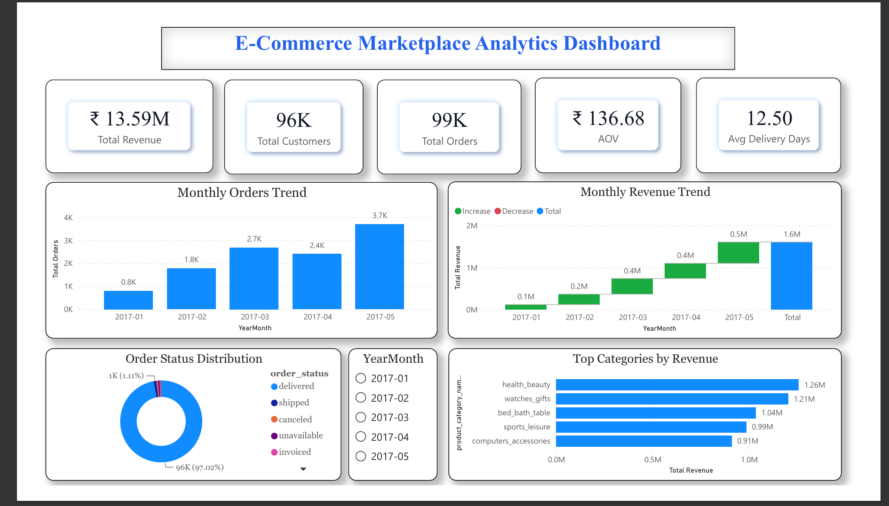
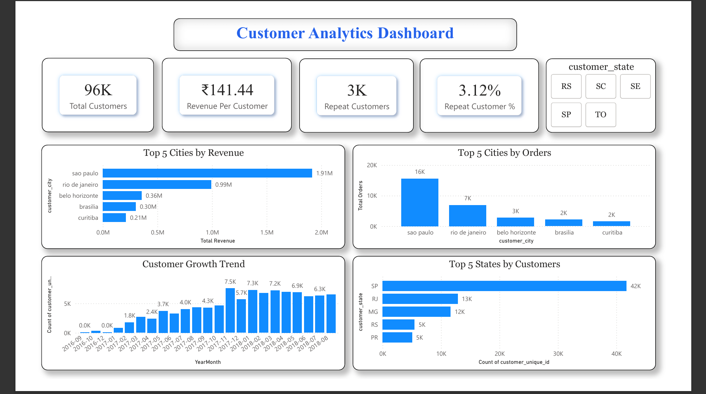
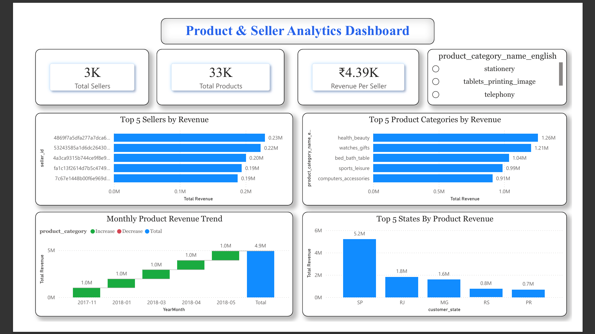

# E-Commerce Marketplace Analytics Dashboard (Power BI + SQL)

## Project Overview

This project analyzes a real-world e-commerce marketplace dataset from Olist (Brazilian E-Commerce Dataset) using SQL and Power BI.

The objective was to transform raw transactional data into actionable business insights by analyzing customer behavior, product performance, seller performance, revenue trends, order fulfillment, and regional sales patterns.

The project follows a business-oriented analytics approach commonly used by Data Analysts to answer questions such as:

* Which product categories generate the highest revenue?
* Which cities and states contribute the most customers and sales?
* How has customer growth changed over time?
* Which sellers drive the majority of marketplace revenue?
* What are the key revenue and order trends across the business?

The final solution includes an interactive Power BI dashboard with Executive Overview, Customer Analytics, and Product & Seller Analytics pages supported by SQL-based business analysis.

## Dataset

**Dataset Name:** Brazilian E-Commerce Public Dataset by Olist

**Source:** Kaggle

The dataset contains information about customers, orders, products, sellers, payments, reviews, and product categories from a real-world e-commerce marketplace.

Key tables used:

* Customers
* Orders
* Order Items
* Products
* Sellers
* Payments
* Category Translation

---

## Tools & Technologies

* SQL (MySQL)
* Power BI
* Data Modeling
* DAX Measures
* Data Cleaning
* Business Analytics

---

## Dashboard Pages

### 1. Executive Overview

* Total Revenue
* Total Orders
* Total Customers
* Average Order Value (AOV)
* Delivery Performance
* Revenue & Order Trends

### 2. Customer Analytics

* Customer Growth Trend
* Repeat Customer Analysis
* Revenue per Customer
* Top Cities by Revenue
* Top Cities by Orders
* Top States by Customers

### 3. Product & Seller Analytics

* Product Category Performance
* Seller Performance
* Product Revenue Trends
* Product Order Trends
* Top Sellers by Revenue
* Revenue Contribution Analysis

## Key Business Insights

### Revenue Performance

* Total marketplace revenue exceeded **13.5 million**.
* Health & Beauty, Watches & Gifts, and Bed Bath & Table were the highest revenue-generating product categories.
* Revenue growth showed strong acceleration during 2017–2018, indicating rapid marketplace expansion.

### Customer Analytics

* The platform served approximately **96K unique customers**.
* Repeat customers represented a small percentage of the customer base, highlighting an opportunity to improve customer retention and loyalty programs.
* Customer growth increased consistently across the analyzed period, demonstrating strong customer acquisition.

### Geographic Insights

* Revenue and orders were concentrated in a limited number of cities and states.
* Certain regions contributed significantly more customers and revenue than others, indicating potential geographic concentration risk and expansion opportunities.

### Product Analytics

* Product performance varied significantly across categories.
* A small number of categories generated a disproportionately large share of revenue, following a Pareto-like distribution.

### Seller Analytics

* Revenue contribution was concentrated among a relatively small group of sellers.
* Top-performing sellers generated significantly higher revenue compared to the marketplace average.
* Seller performance analysis can help identify strategic partners and marketplace growth opportunities.

---

## Business Questions Answered

* Which product categories generate the highest revenue?
* Which cities and states contribute the most customers and sales?
* How has customer growth changed over time?
* Which sellers drive marketplace performance?
* What are the major revenue and order trends?
* Where are the biggest opportunities for growth and retention?

# Dashboard Preview

## Executive Overview

---

## Customer Analytics

---

## Product & Seller Analytics

